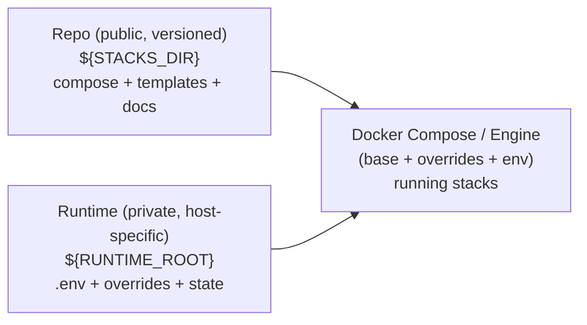

# homelab-stacks

[](https://github.com/hugomolinfresneda/homelab-stacks/actions/workflows/ci.yml)

**Portfolio (context, case studies, screenshots):** https://github.com/hugomolinfresneda/portfolio

**Reproducible Docker Compose stacks with production-minded ops tooling (Makefile-first).**

Clean separation of **versioned config** and **private runtime** (secrets/data/overrides), with documented **backup/DR** and **monitoring runbooks**.

- **Git stays clean:** no secrets / no persistent data committed; runtime lives outside the repo.
- **Repeatable operations:** consistent `make` targets for deploy, status, logs, validation and backups.
- **Ops included:** monitoring + alerting docs + runbooks; DR guidance where applicable.

---

## Ops walkthrough (asciinema)

[](https://asciinema.org/a/JvTlV6qGNXLwTNmn)

## Architecture (repo/runtime contract)



## Requirements

- Linux host with Docker Engine + Docker Compose (plugin)
- GNU Make
- Optional (for `make lint`): `yamllint`, `shellcheck`
> Running rootless Docker? Ensure your runtime paths/socket match the provided templates.

## Quickstart (copy/paste)

```bash
# 0) Set paths (repo + runtime)
export STACKS_DIR="/abs/path/to/homelab-stacks"
export RUNTIME_ROOT="/abs/path/to/homelab-runtime"

cd "$STACKS_DIR"

# 1) First-time setup (per stack): copy runtime templates OUTSIDE the repo,
# then EDIT them to fill placeholders (paths, domains, passwords, etc.).
# Template file names vary per stack — follow the stack README for exact steps.
# See: docs/contract.md and docs/runtime-overrides.md

# 2) Run a stack
make up stack=<name>

# Inspect / troubleshoot
make ps stack=<name>
make logs stack=<name> follow=true

# Stop it
make down stack=<name>
```
> Tip: choose a stack from `stacks/` (e.g. `stack=monitoring`, `stack=nextcloud`).

## Quality checks (optional)

```bash
# Validate compose configs for all stacks (equivalent to `docker compose config -q`)
make validate

# Lint YAML and shell scripts (requires `yamllint` + `shellcheck`)
# Note: ShellCheck output is advisory; it will not fail the target.
make lint
```

## Design: versioned repo, private runtime (clean Git, reproducible ops)

This project follows a strict **repo/runtime contract**:

- **Repo (public, versioned)**: `${STACKS_DIR}`
  Compose bases, templates (`*.example`), documentation and ops tooling.

- **Runtime (private, not versioned)**: `${RUNTIME_ROOT}`
  Host-specific configuration (**edited from templates**), secrets, persistent data and overrides.

> (See the diagram above for the high-level flow.)

### Why this layout
- **Security hygiene:** keep secrets/state out of Git by design.
- **Portability:** same repo works across hosts; only `${RUNTIME_ROOT}` changes.
- **Operability:** per-host overrides without forking or “works on my NAS” drift.

### Typical layout

```text
${STACKS_DIR}/                      # versioned (public)
  stacks/                           # deployable stacks (each owns its README)
    <stack>/...
  ops/                              # operational tooling (backups)
  docs/                             # contract and shared guides

${RUNTIME_ROOT}/                    # private (NOT in Git)
  stacks/<stack>/
    .env                            # stack-specific config (edited from .env.example)
    compose.override.yaml           # runtime override (edited from *.override.example)
    data/                           # persistent state (when applicable)
```

If a stack needs persistence/secrets, create/edit its runtime files under:
`${RUNTIME_ROOT}/stacks/<stack>`.

Read first:

- docs/contract.md
- docs/runtime-overrides.md

## Stacks (at a glance)

| Stack | Purpose | Ops docs | README |
|---|---|---|---|
| `monitoring` | Metrics / logs / alerts | **alerting docs**, **runbooks** | `stacks/monitoring/README.md` |
| `nextcloud` | File sync / collab | **backup**, **DR** | `stacks/nextcloud/README.md` |
| `adguard-home` | DNS / ad-blocking | — | `stacks/adguard-home/README.md` |
| `cloudflared` | Tunnel / ingress | — | `stacks/cloudflared/README.md` |
| `couchdb` | Database | — | `stacks/couchdb/README.md` |
| `dozzle` | Container logs UI | — | `stacks/dozzle/README.md` |
| `uptime-kuma` | Uptime checks | — | `stacks/uptime-kuma/README.md` |

## Operations

Operations are documented alongside the stacks: **backup/restore**, **disaster recovery**, **alerting**, and **runbooks**.

### Entry points
- Need a full **Nextcloud restore**? Start at `stacks/nextcloud/backup/README.dr.md`.
- Alert fired? Go to `stacks/monitoring/runbooks/`.

### Backups & DR
- **Infra backups (Restic-based):** `ops/backups/README.md`
- **Nextcloud:**
  - **Backup workflow:** `stacks/nextcloud/backup/README.backup.md`
  - **Disaster recovery (restore end-to-end):** `stacks/nextcloud/backup/README.dr.md`

### Monitoring & Alerting
- **Monitoring stack:** `stacks/monitoring/README.md`
- **Alerting docs (rules, routing, integrations):** `stacks/monitoring/docs/alerting/`
- **Runbooks:** `stacks/monitoring/runbooks/`

## Non-goals (set expectations)

- Not a one-click installer for every environment (host-specific runtime is required).
- No secrets or persistent data are committed to this repo (by design).
- You own your runtime and threat model.
- Not a managed product with SLAs.

## Changelog
See `CHANGELOG.md`.

## License
Apache-2.0 — see `LICENSE`.
